# NVIDIA Omniverse Performance Profiling & Benchmarking Guide

---

## Table of Contents

1. [Profiling Backend Types](#1-profiling-backend-types)
2. [Captured Spans — C++ Macros](#2-captured-spans--c-macros)
3. [Captured Spans — Python API](#3-captured-spans--python-api)
4. [Automatic Python Function Capture (CARB_PROFILING_PYTHON)](#4-automatic-python-function-capture)
5. [Profiler Mask](#5-profiler-mask)
6. [Profiler Channels](#6-profiler-channels)
7. [Profiling Overhead and the COLD/WARM/TRACY Methodology](#7-profiling-overhead-and-the-coldwarmtracy-methodology)
8. [Tracy Statistics-Based Analysis](#8-tracy-statistics-based-analysis)
9. [Adding Tracy Plot Data (Stat)](#9-adding-tracy-plot-data-stat)
10. [Adding Event Messages / Annotations](#10-adding-event-messages--annotations)
11. [Tracy Capture (Detailed)](#11-tracy-capture-detailed)
12. [Nsight Systems Capture (Detailed)](#12-nsight-systems-capture-detailed)
13. [External Sampling Profilers (Superluminal, etc.)](#13-external-sampling-profilers)
14. [Common Performance Issues and Solutions](#14-common-performance-issues-and-solutions)

---

## 1. Profiling Backend Types

The Carbonite (carb) profiling subsystem supports **3 backends**. Each backend is implemented as an independent plugin. A multiplexer allows using multiple backends simultaneously.

### 1.1 CPU (ChromeTrace) Backend

| Item | Details |
|------|---------|
| **Plugin** | `carb.profiler-cpu.plugin` |
| **Output Format** | Chrome Trace JSON (`.json` or `.gz`) |
| **Viewers** | Chrome (`chrome://tracing`), Perfetto (`ui.perfetto.dev`), Tracy (after import-chrome conversion) |
| **Use Case** | Offline analysis, short targeted captures, easy to share |

**Advantages:**
- Profiler can be toggled **on/off** at runtime, enabling targeted capture of specific intervals
- No separate capture process (like Tracy capture) required
- JSON output can be opened anywhere
- Perfetto SQL query analysis supported (`pip install perfetto`)

**Activation:**
```bash
# By default, if profilerBackend is not specified, the CPU backend runs behind the multiplexer
--/app/profilerBackend="cpu"
--/app/profileFromStart=true
--/profiler/enabled=true

# Save settings
--/plugins/carb.profiler-cpu.plugin/saveProfile=1
--/plugins/carb.profiler-cpu.plugin/compressProfile=1
--/plugins/carb.profiler-cpu.plugin/filePath="mytrace.gz"
```

**Runtime on/off (Python):**
```python
import carb.profiler

profiler = carb.profiler.acquire_profiler_interface()

# Start capture — set mask to desired value
profiler.set_capture_mask(1)

# ... section to profile ...

# Stop capture — set mask to 0
profiler.set_capture_mask(0)
```

**Chrome JSON to Tracy conversion:**

The `import-chrome` binary provided by Tracy converts Chrome Trace JSON to Tracy format:
```bash
# From the Tracy binary directory
./import-chrome input_trace.json output.tracy
```

**CPU profiling result viewed in Perfetto:**

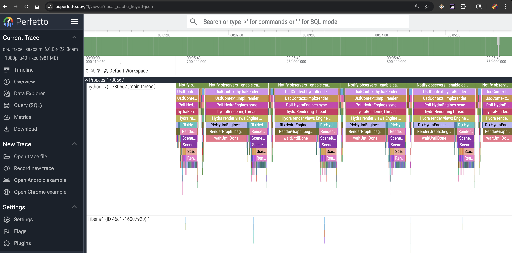

The screenshot above shows an Isaac Sim 6.0.0-rc.22 benchmark (8 cameras, 1920x1080) captured with the CPU backend and opened in Perfetto (`ui.perfetto.dev`). The Main Thread (`python_7`) shows the Kit rendering pipeline spans per frame — `Notify observers`, `Pull HydraEngine sync`, `RtxHydraEngine`, `RenderGraphBuilder`, `hydraMonitoringThread`, etc. Fiber thread activity is also captured.


### 1.2 Tracy Backend

| Item | Details |
|------|---------|
| **Plugin** | `carb.profiler-tracy.plugin` |
| **Output Format** | Live Tracy connection → captured as `.tracy` file |
| **Viewers** | Tracy Profiler (GUI), tracy csvexport (CLI) |
| **Use Case** | Most frequently used backend. Real-time flame graphs, GPU context, memory, statistics |

**Advantages:**
- **GPU Context**: GPU frametimes and spans visible on the timeline alongside CPU functions
- **Statistics**: Memory usage, RTX stats, CPU usage, and other metrics analyzed together
- **Plot Data**: Numeric metrics displayed as time-series graphs (FPS, GPU VRAM, frame time, etc.)
- **Flow Events**: Cross-thread data flow visualized as arrows
- **Lock Analysis**: Mutex/lock contention analysis
- The **most commonly used** profiling backend in internal development

**Activation:**
```bash
--/app/profilerBackend=tracy
--/app/profileFromStart=true
--/profiler/enabled=true
--/profiler/gpu=true
--/profiler/gpu/tracyInject/enabled=true
--/app/profilerMask=1
--/plugins/carb.profiler-tracy.plugin/fibersAsThreads=false
--/profiler/channels/carb.events/enabled=false
--/profiler/channels/carb.tasking/enabled=false
--/profiler/gpu/tracyInject/msBetweenClockCalibration=0
--/rtx/addTileGpuAnnotations=true
--/plugins/carb.profiler-tracy.plugin/instantEventsAsMessages=true
```

> **Note — Noise prevention settings:** `fibersAsThreads=false` prevents Carbonite fibers from appearing as hundreds of fake threads in Tracy. Disabling `carb.events` and `carb.tasking` channels removes large volumes of unnecessary spans from event dispatch and task scheduling, reducing Tracy file size and improving analysis readability.

**Environment variables:**
```bash
export TRACY_NO_SYS_TRACE=1       # Disable system tracing (reduces noise)
export TRACY_NO_CALLSTACK=1       # Disable callstack collection (reduces overhead)
```

**Tracy port:**
- Default port: `8086`
- Isaac Sim 6.0+: `8087` (to avoid conflict with OV Hub using 8086)
- Kit automatically increments to 8087, 8088... on port conflict

**Two connection modes:**
1. **On Demand (GUI):** Enable `omni.kit.profiler.tracy` extension → Profiling → Tracy → Launch and Connect
2. **From Startup (CLI):** Start with `--/app/profilerBackend="tracy" --/app/profileFromStart=true` + separate `capture` process


### 1.3 NVTX Backend

| Item | Details |
|------|---------|
| **Plugin** | `carb.profiler-nvtx.plugin` |
| **Output Format** | NVTX annotations → captured via `nsys profile` as `.nsys-rep` file |
| **Viewers** | Nsight Systems GUI (`nsys-ui`), nsys CLI |
| **Use Case** | Accurate GPU activity, CUDA API, Vulkan API, and hardware-level analysis |

**Advantages:**
- Tracy and CPU spans are captured as **NVTX ranges** in Nsight
- Accurate **GPU activity**-based analysis: CUDA kernels, Vulkan API calls, etc.
- **Hardware counters**: GPU memory, GPU context switch, CPU sampling, etc.
- Frequently used for profiling/analysis of **Isaac Sim and Isaac Lab** (heavy CUDA usage)

**Disadvantages:**
- `nsys profile` capture is slightly more complex than other backends
- Often requires `sudo` privileges (system-wide sampling, GPU context switch)
- Capture overhead is higher than Tracy (~10-20%)

**Activation:**
```bash
--/app/profilerBackend=nvtx
--/app/profileFromStart=true
--/profiler/enabled=true
--/profiler/gpu=true
--/app/profilerMask=1
--/plugins/carb.profiler-tracy.plugin/fibersAsThreads=false
--/profiler/channels/carb.events/enabled=false
--/profiler/channels/carb.tasking/enabled=false
```

---

## 2. Captured Spans — C++ Macros

### 2.1 Core Macros (carb/profiler/Profile.h)

**Source:** Carbonite SDK `carb/profiler/Profile.h`
**Documentation:** [Carbonite Helper Macros](https://docs.omniverse.nvidia.com/kit/docs/carbonite/latest/api/group__Profiler.html)

#### CARB_PROFILE_ZONE — Scope-Based Zone

The most commonly used macro. Uses RAII — starts on scope entry, ends automatically on scope exit.

```cpp
#include <carb/profiler/Profile.h>

constexpr const uint64_t kProfilerMask = 1;

void myFunction()
{
    CARB_PROFILE_ZONE(kProfilerMask, "My C++ function");
    // Zone closes automatically when this scope ends
    doHeavyWork();
}
```

**Parameters:**
- `maskOrChannel` — `uint64_t` bitmask or `carb::profiler::Channel` reference
- `zoneName` — Static string literal or printf-style format string
- `...` — Optional variadic arguments (for format string)

**Internal behavior:** Branches at compile time based on variadic argument presence:
- No variadic args → `ProfileZoneStatic` (pre-registered static string, faster)
- With variadic args → `ProfileZoneDynamic` (printf formatting support)
- Both call `IProfiler::beginStatic()` / `beginDynamic()` in the constructor and `endEx()` in the destructor

#### CARB_PROFILE_FUNCTION — Auto-Uses Function Name

```cpp
void myFunction()
{
    CARB_PROFILE_FUNCTION(kProfilerMask);
    // Zone name is automatically set to the function's pretty-printed name
}
```

#### CARB_PROFILE_BEGIN / END — Manual Zone

```cpp
void myFunction()
{
    auto zoneId = CARB_PROFILE_BEGIN(kProfilerMask, "Manual zone");
    // ... work ...
    CARB_PROFILE_END(kProfilerMask, zoneId);
}
```

`BEGIN` returns a `ZoneId` that must be passed to `END`. RAII style (`CARB_PROFILE_ZONE`) is recommended.

### 2.2 GPU Zone Capture

Kit's RTX renderer captures GPU zones using a **query-based** approach:

```cpp
// Create GPU context (at app initialization)
auto gpuCtx = CARB_PROFILE_CREATE_GPU_CONTEXT(
    "Vulkan GPU",
    cpuTimestampNs,
    gpuTimestamp,
    gpuTimestampPeriodNs,
    "vulkan"
);

// GPU work begin/end
CARB_PROFILE_GPU_QUERY_BEGIN(kProfilerMask, gpuCtx, queryId, "RTX Render Pass");
// ... submit GPU commands ...
CARB_PROFILE_GPU_QUERY_END(kProfilerMask, gpuCtx, queryId);

// Set GPU timestamp result (from previous frame's query)
CARB_PROFILE_GPU_SET_QUERY_VALUE(kProfilerMask, gpuCtx, queryId, gpuTimestamp);
```

**To see GPU zones in Tracy:**
```bash
--/profiler/gpu/tracyInject/enabled=true    # Inject GPU zones into Tracy
--/rtx/addTileGpuAnnotations=true           # RTX tile-level GPU annotations
```

---

## 3. Captured Spans — Python API

### 3.1 Decorator Style (Simplest)

```python
import carb.profiler

@carb.profiler.profile
def my_function():
    """This entire function is captured as a single zone"""
    do_something()
```

### 3.2 Manual begin/end Style

```python
import carb.profiler

def my_function():
    carb.profiler.begin(1, "My Python operation")
    # ... work ...
    carb.profiler.end(1)
```

### 3.3 Full IProfiler Interface

```python
profiler = carb.profiler.acquire_profiler_interface()

# Zone profiling
profiler.begin(mask: int, name: str) -> None
profiler.end(mask: int) -> None

# Capture mask control
profiler.set_capture_mask(mask: int) -> int     # Returns previous mask
profiler.get_capture_mask() -> int

# Record numeric values (Tracy Plot)
profiler.value_float(mask: int, value: float, name: str) -> None
profiler.value_int(mask: int, value: int, name: str) -> None
profiler.value_uint(mask: int, value: int, name: str) -> None

# Instant events
profiler.instant(mask: int, type: InstantType, name: str) -> None

# Flow events (cross-thread linkage)
profiler.flow(mask: int, type: FlowType, id: int, name: str) -> None

# Frame markers
profiler.frame(mask: int, name: str) -> None

# Python auto-profiling control
profiler.set_python_profiling_enabled(enable: bool) -> None
profiler.is_python_profiling_enabled() -> bool
```

**Type enums:**
```python
carb.profiler.InstantType.THREAD    # Recorded on the current thread timeline
carb.profiler.InstantType.PROCESS   # Recorded on the process-wide timeline

carb.profiler.FlowType.BEGIN         # Flow start
carb.profiler.FlowType.END           # Flow end
```

---

## 4. Automatic Python Function Capture

### CARB_PROFILING_PYTHON Environment Variable

All Python function calls can be **captured automatically** without adding profiling zones to individual functions.

```bash
export CARB_PROFILING_PYTHON=1
```

**How it works:**
- Hooks into the Python interpreter's C API to intercept all function call/return events
- Each Python function appears in the trace with a `(Python)` suffix
- Works with all backends: Tracy, NVTX, CPU

**Programmatic control:**
```python
profiler = carb.profiler.acquire_profiler_interface()
profiler.set_python_profiling_enabled(True)   # Enable
profiler.set_python_profiling_enabled(False)  # Disable
```

**Performance warning:**
- Python profiling introduces **significant overhead**
- Tracy file size increases substantially (measured: ~275MB with `CARB_PROFILING_PYTHON=0` → ~1.2GB with `=1`; Python profiling data accounts for ~77% of the total)
- **Never use during benchmark measurement** — use only in the TRACY phase

---

## 5. Profiler Mask

### 5.1 What is a Mask?

The profiler mask is a 64-bit bitmask that controls **which profiling zones are captured**.

Every `CARB_PROFILE_ZONE` (C++) or `carb.profiler.begin()` (Python) call takes a mask parameter. For a zone to be captured:

```
(zone_mask & capture_mask) != 0
```

This condition must be satisfied.

### 5.2 Default Mask Constants (IProfiler.h)

```cpp
constexpr uint64_t kCaptureMaskNone    = 0;                        // Capture nothing
constexpr uint64_t kCaptureMaskAll     = (uint64_t)-1;             // 0xFFFFFFFFFFFFFFFF — capture everything
constexpr uint64_t kCaptureMaskDefault = uint64_t(1);              // Bit 0 — default mask
constexpr uint64_t kCaptureMaskProfiler = uint64_t(1) << 63;      // Bit 63 — profiler internals
```

If mask `0` is passed, it is automatically replaced with `kCaptureMaskDefault(1)`.

### 5.3 Why the Runtime Performance Team Uses profilerMask=1 for Benchmarks

**Practical workflow:**

```
Step 1: Capture with --/app/profilerMask=1
   → Only captures "major spans" registered with mask 1 (bit 0)
   → Minimizes profiling overhead
   → Identifies overall bottlenecks

Step 2: Bottleneck found → need finer detail in that area
   → Remove --/app/profilerMask from Kit args (or set a larger value)
   → Default kCaptureMaskAll (0xFFFFFFFFFFFFFFFF) takes effect
   → All zones across all masks are captured
   → Overhead increases, but enables detailed analysis

Conclusion: Always start with the big picture (mask=1),
   then progressively increase detail as needed.
```

**Kit args configuration:**
```bash
# Major spans only (Step 1 — recommended starting point)
--/app/profilerMask=1

# All spans (Step 2 — omit profilerMask to use default ALL)
# Remove the --/app/profilerMask argument
```

**Capturing all masks causes:**
- Too many zones captured, **significantly increasing** profiling overhead
- Tracy file size increases substantially
- `carb.events` and `carb.tasking` channels in particular generate large amounts of noise

### 5.4 Mask Configuration in Kit

From `omni.kit.profiler.window` `profiler.py`:
```python
mask = self._settings.get_as_int("/app/profilerMask")
if mask < 0:
    # Default is all bits set (interpreted as -1 in Python)
    mask = mask + 0x010000000000000000
self._enabled_capture_mask = mask
```

---

## 6. Profiler Channels

Channels are a higher-level abstraction over masks. Channels can be toggled at runtime via ISettings.

### 6.1 Channel Declaration (C++)

```cpp
// Channel declaration (in header)
CARB_PROFILE_DECLARE_CHANNEL(
    "myext.rendering",    // Name (used in settings path)
    1,                     // Default mask
    true,                  // Enabled by default
    g_myRenderingChannel   // C++ variable name
);

// Reference from other compilation units
CARB_PROFILE_EXTERN_CHANNEL(g_myRenderingChannel);

// Usage
CARB_PROFILE_ZONE(g_myRenderingChannel, "My rendering work");
```

### 6.2 Runtime Channel Control

Channels are controlled via Settings paths:
```bash
--/profiler/channels/<name>/enabled=true|false
```

**Channels frequently disabled during benchmarks:**
```bash
--/profiler/channels/carb.events/enabled=false     # Carbonite events (noisy)
--/profiler/channels/carb.tasking/enabled=false     # Carbonite tasking (noisy)
```

### 6.3 Memory-Related Channels

```bash
--/profiler/channels/cpu.memory/enabled=true        # CPU memory allocation tracking
--/profiler/channels/cpu.virtualmemory/enabled=true  # Virtual memory tracking
--/profiler/channels/graphics.memory/enabled=true    # GPU/graphics memory tracking
```

---

## 7. Profiling Overhead and the COLD/WARM/TRACY Methodology

### 7.1 Core Principle: Do Not Measure Performance While Capturing Profiling Data

**Profiling overhead is always present.** Even when capturing only minimal zones with `profilerMask=1`, the profiling infrastructure itself adds overhead.

| Profiling State | Overhead | Reporting Use |
|----------------|----------|---------------|
| **No profiler** | 0% (actual performance) | User-facing benchmark results |
| **Tracy capture** | ~5-15% (CPU-centric) | Zone-level analysis/verification |
| **Nsight Systems capture** | ~10-20% (GPU-centric) | GPU kernel/NVTX analysis |
| **CARB_PROFILING_PYTHON=1 added** | Significant additional overhead (workload-dependent) | Python function-level analysis |

Therefore, when comparing and reporting benchmark results, **never attach a profiler**.

### 7.2 COLD / WARM / TRACY 3-Phase Methodology

The OmniPerf team runs benchmarks **3 times**, each serving a different purpose:

```
+--------------------------------------------------------------+
|  Phase 1: COLD                                               |
|  ---------                                                   |
|  - Cache initialization (clear_all_cache())                  |
|  - Shader cache and driver cache (PSO) build                 |
|  - Cold start performance measurement                        |
|  - Profiler: disabled                                        |
|  - CARB_PROFILING_PYTHON: disabled                           |
|  - Results: cold start reference (not typically reported)     |
+--------------------------------------------------------------+
|  Phase 2: WARM                                               |
|  ---------                                                   |
|  - Uses caches built in COLD as-is                           |
|  - Represents real production environment performance         |
|  - Profiler: disabled                                        |
|  - CARB_PROFILING_PYTHON: disabled                           |
|  - Results: User-facing benchmark results (use only this!)   |
+--------------------------------------------------------------+
|  Phase 3: TRACY                                              |
|  ---------                                                   |
|  - Same cache state as WARM                                  |
|  - Tracy backend enabled                                     |
|  - CARB_PROFILING_PYTHON=1 set                               |
|  - .tracy file captured via separate capture process          |
|  - Results: profiling analysis only (do not report numbers)   |
+--------------------------------------------------------------+
```

**Key point: WARM results are the "real" benchmark. TRACY results are for analysis only.**

---

## 8. Tracy Statistics-Based Analysis

### 8.1 Why Looking at a Single Frame is Insufficient

When analyzing profiling data, **looking at only 1 frame's function duration** can lead to incorrect comparisons:

- That frame may be an outlier (GC, swap, interference from other processes)
- A single sample has no statistical significance
- GPU zones in particular can have high variance between frames

### 8.2 Using the Tracy Statistics View

Use the **Statistics** view in the Tracy Profiler GUI:

1. **Open Statistics window:** View → Statistics (or Ctrl+S)
2. **Set Range Limit:**
   - Drag-select the interval to analyze on the Tracy timeline
   - Statistics automatically aggregates samples within that range only
3. **Key metrics:**
   - **Mean:** Average duration
   - **Median:** Median value (less sensitive to outliers)
   - **Min / Max:** Minimum / maximum values
   - **Std Dev:** Standard deviation (for consistency assessment)
   - **Count:** Number of calls
   - **Total Time:** Total elapsed time

### 8.3 Regression / Optimization Comparison Method

```
Before (baseline):
   1. Tracy capture → save .tracy file
   2. Set Range Limit in Statistics (steady-state interval)
   3. Record Mean, Median, Count of key zones

After (optimization):
   1. Tracy capture under identical conditions → save .tracy file
   2. Compare Statistics with the same Range Limit
   3. Check Mean, Median changes of key zones

Comparison guidelines:
   - Same hardware, same scene, same parameters
   - Range Limit over equal-length steady-state intervals
   - If the issue occurs in only 1 frame, run the benchmark multiple times to verify reproducibility
```

### 8.4 Automated Analysis with Tracy csvexport

Extract zone statistics from Tracy files as CSV:

```bash
# Use the Tracy csvexport binary
/path/to/tracy/csvexport trace.tracy > zones.csv

# Filter statistics for a specific zone
grep "App Update" zones.csv
```

**Programmatic comparison (Python):**
```python
import csv

def parse_tracy_csv(filepath):
    zones = {}
    with open(filepath) as f:
        reader = csv.DictReader(f)
        for row in reader:
            name = row['name']
            zones[name] = {
                'mean_ns': float(row.get('mean', 0)),
                'count': int(row.get('count', 0)),
                'total_ns': float(row.get('total_time', 0)),
            }
    return zones

before = parse_tracy_csv("before_zones.csv")
after = parse_tracy_csv("after_zones.csv")

# Compare key zones
for zone_name in ["App Update", "UsdContext hydraRender", "PhysXUpdate"]:
    b = before.get(zone_name, {})
    a = after.get(zone_name, {})
    if b and a:
        diff = ((a['mean_ns'] - b['mean_ns']) / b['mean_ns']) * 100
        print(f"{zone_name}: {b['mean_ns']/1e6:.2f}ms → {a['mean_ns']/1e6:.2f}ms ({diff:+.1f}%)")
```

---

## 9. Adding Tracy Plot Data (Stat)

Tracy's Plot feature displays numeric metrics as **time-series graphs**.

### 9.1 C++ — CARB_PROFILE_VALUE Macro

```cpp
#include <carb/profiler/Profile.h>

// Record float value
float gpuFrameTimeMs = 8.5f;
CARB_PROFILE_VALUE(gpuFrameTimeMs, 1, "GPU Frame Time (ms)");

// Record int value
int32_t triangleCount = 1500000;
CARB_PROFILE_VALUE(triangleCount, 1, "Triangle Count");

// Record uint value
uint32_t gpuMemoryMB = 4096;
CARB_PROFILE_VALUE(gpuMemoryMB, 1, "GPU Memory (MB)");

// printf-style dynamic name
int gpuIndex = 0;
CARB_PROFILE_VALUE(gpuFrameTimeMs, 1, "GPU %d Frame Time", gpuIndex);
```

**Internal behavior:**
- `float` → `IProfiler::valueFloatStatic()` / `valueFloatDynamic()`
- `int32_t` → `IProfiler::valueIntStatic()` / `valueIntDynamic()`
- `uint32_t` → `IProfiler::valueUIntStatic()` / `valueUIntDynamic()`
- In the Tracy backend, these are converted to `TracyPlot` API calls → visualized as plots in the Tracy viewer

### 9.2 Python — profiler.value_float() / value_int() / value_uint()

```python
import carb.profiler

profiler = carb.profiler.acquire_profiler_interface()

# Record float value
profiler.value_float(1, 8.5, "GPU Frame Time (ms)")

# Record int value
profiler.value_int(1, 1500000, "Triangle Count")

# Record uint value
profiler.value_uint(1, 4096, "GPU Memory (MB)")
```

---

## 10. Adding Event Messages / Annotations

### 10.1 Instant Events

The most basic method to place a marker at a specific point on the timeline:

**C++:**
```cpp
// Record event on the current thread timeline
CARB_PROFILE_EVENT(1, carb::profiler::InstantType::Thread, "Scene loading started");

// Record event on the process-wide timeline
CARB_PROFILE_EVENT(1, carb::profiler::InstantType::Process, "Phase transition: WARM -> BENCHMARK");
```

**Python:**
```python
import carb.profiler

profiler = carb.profiler.acquire_profiler_interface()

# Thread-level event
profiler.instant(1, carb.profiler.InstantType.THREAD, "Scene loading started")

# Process-level event
profiler.instant(1, carb.profiler.InstantType.PROCESS, "Phase transition")
```

### 10.2 How Events Appear in Tracy

**Default behavior (`instantEventsAsMessages=false`):**
- Instant events appear as **"fake zones"** (0-duration zones)

**Display as Tracy messages (`instantEventsAsMessages=true`):**
```bash
--/plugins/carb.profiler-tracy.plugin/instantEventsAsMessages=true
```
With this setting enabled, events sent via `CARB_PROFILE_EVENT` or `profiler.instant()` appear in Tracy's **Messages** panel. Displayed as clean messages instead of 0-duration zones.

**How to view messages in Tracy:**

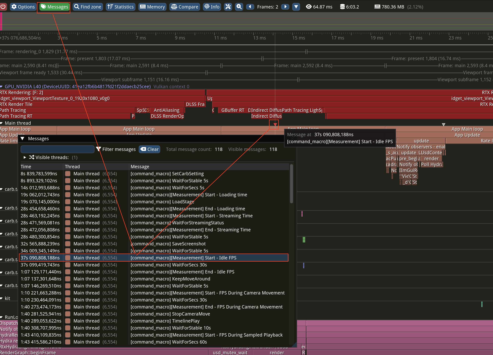

Click the **Messages** tab at the top of Tracy to see a list of recorded messages. Clicking a specific message in the list scrolls the timeline to that point. Message positions on the timeline are shown as **inverted triangle markers** on the thread row (e.g., Main Thread). Hovering over a marker displays the message content and exact timestamp in a tooltip. In the screenshot above, the `[command_macro][Measurement] Start - Idle FPS` message is recorded at the 37s mark.

### 10.3 Annotation Usage in command_macro.core

The `omni.kit.command_macro.core` extension inserts annotations during benchmark execution in two ways:

**1. Profiler instant events (trace-level):**

Automatically inserted in `macro_manager.py` when `MeasurementCommand` executes:
```python
# At MeasurementCommand start
self._profiler.instant(
    1, carb.profiler.InstantType.THREAD,
    f"[command_macro][Measurement] Start - {cmd_tag}"
)

# At MeasurementCommand end
self._profiler.instant(
    1, carb.profiler.InstantType.THREAD,
    f"[command_macro][Measurement] End - {cmd_tag}"
)
```

**2. Performance collector annotations (chart-level):**

`ScopedSampleAggregator` inserts markers into benchmark charts:
```python
async def start_measurement(self, perf_collector, hide_annotation=False):
    tag = self.get_resolved_property_value("tag")
    perf_collector.start_measurement(tag)
    if perf_collector.get_collector_type() == "basic" and not hide_annotation:
        perf_collector.add_annotation(f"Start measuring - {tag}")
```

### 10.4 Adding Custom Annotations

To add custom annotations to the trace from your own code:

```python
import carb.profiler

profiler = carb.profiler.acquire_profiler_interface()

# Simple event marker
profiler.instant(1, carb.profiler.InstantType.THREAD, "My custom marker")

# Zone to mark an interval
profiler.begin(1, "Data preprocessing")
preprocess_data()
profiler.end(1)

# Record numeric value (Tracy Plot)
profiler.value_float(1, 42.5, "custom_metric")

# Frame marker
profiler.frame(1, "custom_frame")
```

---

## 11. Tracy Capture (Detailed)

### 11.1 Obtaining Tracy Binaries

**Option 1: Build Tracy 0.11.1 from source (recommended)**

Clone the upstream Tracy project and build the capture binary locally. Make sure to check out the `v0.11.1` tag so the version matches what Kit's `carb_sdk_plugins` (>= 178) streams out.

```bash
git clone https://github.com/wolfpld/tracy.git
cd tracy
git checkout v0.11.1
# Build the headless capture tool
cd capture/build/unix    # Linux
make release
# The capture binary is at capture/build/unix/capture-release
```

For Windows, open `capture/build/win32/capture.sln` in Visual Studio and build the Release configuration.

**Option 2: Use the bundled binary from `omni.kit.profiler.tracy`**

Building [Isaac Sim from source](https://github.com/isaac-sim/IsaacSim) (or any Kit-based app) downloads the `omni.kit.profiler.tracy` extension, which ships the matching Tracy `capture` binary. Look under one of:

- `exts/omni.kit.profiler.tracy/`
- `extscore/omni.kit.profiler.tracy/`
- `extscache/omni.kit.profiler.tracy/`

Using this binary guarantees version compatibility with the Tracy protocol embedded in Kit.

### 11.2 Tracy Version Compatibility

The Tracy version depends on the `carb_sdk_plugins` version inside Kit:

| carb_sdk_plugins Version | Tracy Version |
|-------------------------|---------------|
| < 178 | 0.9.1 (legacy) |
| >= 178 | 0.11.1+nv1 (current) |

Check the `carb_sdk_plugins` version in Kit's `all-deps.packman.xml` to use the correct Tracy version.

### 11.3 Capture Sequence (CRITICAL)

**Follow this order strictly:**

```
1. Kill existing capture processes
   └─ pkill -9 -f "capture" 2>/dev/null
   └─ ss -tlnp | grep :8086  # Verify port is free

2. Start the application first (background)
   └─ nohup ./python.sh benchmark.py \
        --/app/profilerBackend=tracy \
        --/app/profileFromStart=true \
        [other Tracy settings...] \
        > output.log 2>&1 & echo "PID=$!"

3. Wait for the Tracy port to open (max 60 retries x 2 seconds)
   └─ for i in $(seq 1 60); do
        ss -tlnp | grep :8086 && break || sleep 2
      done

4. Start capture (after port is open)
   └─ /path/to/tracy/capture -o trace.tracy -f [-p 8087]

5. Wait for benchmark completion
   └─ Determined by checking for result files (kpis_*.json)
   └─ Isaac Sim hangs during shutdown — force-kill once result files exist

6. Force-kill processes
   └─ kill -9 $BENCH_PID $CAPTURE_PID 2>/dev/null
```

**Never do the following:**
- Do not terminate capture with SIGTERM (file may not be saved)
- Do not wait for Isaac Sim's graceful shutdown (it will never finish — known bug)

> **Note:** Starting capture before the app also works. Capture attempts to connect to the specified host:port and waits until the app starts. However, the order above (app first → verify port → start capture) is the most reliable.

### 11.4 Tracy File Compression

Tracy files can grow to hundreds of MB or several GB, so compression matters.

**Step 1: Default compression by the `capture` binary**

The `capture` binary applies **LZ4 compression by default** when saving `.tracy` files. No extra configuration needed — files are already compressed at capture time.

**Step 2: Additional compression with the `update` binary (optional)**

To convert captured files to a higher compression format, use the Tracy `update` tool:

```bash
# Re-compress with zstd compression level 1 (fast with better ratio)
/path/to/tracy/update -z 1 original.tracy recompressed.tracy

# Remove original
rm original.tracy
```

> **Use case:** For sharing large Tracy files or long-term storage. For typical analysis purposes, the default compression from `capture` is sufficient.

### 11.5 Key Kit Parameters for Tracy Capture

Main parameters for running Kit-based apps with Tracy capture:

```bash
--/app/profilerBackend=tracy
--/app/profileFromStart=true
--/profiler/enabled=true
--/profiler/gpu=true
--/profiler/gpu/tracyInject/enabled=true
--/app/profilerMask=1
--/plugins/carb.profiler-tracy.plugin/fibersAsThreads=false
--/profiler/channels/carb.events/enabled=false
--/profiler/channels/carb.tasking/enabled=false
--/rtx/addTileGpuAnnotations=true
```

**Parameter descriptions:**

| Parameter | Purpose |
|-----------|---------|
| `--/app/profilerBackend=tracy` | Select Tracy backend |
| `--/app/profileFromStart=true` | Profile from app startup |
| `--/profiler/enabled=true` | Enable profiling subsystem (required for all backends) |
| `--/profiler/gpu=true` | Enable GPU profiling |
| `--/profiler/gpu/tracyInject/enabled=true` | Inject GPU zones into Tracy |
| `--/app/profilerMask=1` | Capture only major spans with mask 1 (bit 0) — minimizes overhead |
| `--/plugins/carb.profiler-tracy.plugin/fibersAsThreads=false` | Do not display Carbonite fibers as separate threads → **prevents hundreds of fake threads appearing in Tracy** |
| `--/profiler/channels/carb.events/enabled=false` | Disable Carbonite events channel → **removes large volumes of spans from event dispatch to reduce noise** |
| `--/profiler/channels/carb.tasking/enabled=false` | Disable Carbonite tasking channel → **removes large volumes of spans from task scheduling to reduce noise** |
| `--/rtx/addTileGpuAnnotations=true` | Add RTX tile-level GPU annotations |

> **Why disable `fibersAsThreads`, `carb.events`, and `carb.tasking`:** Leaving these at defaults causes thousands to tens of thousands of unnecessary spans to be captured, which (1) significantly increases Tracy file size, (2) makes finding actual bottlenecks in the Tracy viewer harder, and (3) increases profiling overhead itself. These must be disabled to get a clean view of only the essential zones for performance analysis.

**Important: The capture process must run in a separate terminal or as a separate process.** After the app starts and the Tracy server port is open, run the `capture` binary from another terminal to save the `.tracy` file.

---

## 12. Nsight Systems Capture (Detailed)

### 12.1 nsys Installation

**Linux: Download the latest standalone package (recommended)**

Download and install the latest version of Nsight Systems directly. The version bundled with the CUDA Toolkit may not be the latest.

```bash
# Download the latest .deb from the NVIDIA developer site
# Check the latest version at https://developer.nvidia.com/nsight-systems
wget https://developer.nvidia.com/downloads/assets/tools/secure/nsight-systems/2026_2/nsight-systems-2026.2.1_2026.2.1.210-1_amd64.deb
sudo dpkg -i nsight-systems-*.deb
nsys --version
```

**Windows: Download the latest standalone installer**

```
# Download the latest .msi from the NVIDIA developer site
# Check the latest version at https://developer.nvidia.com/nsight-systems
https://developer.nvidia.com/downloads/assets/tools/secure/nsight-systems/2026_2/NsightSystems-2026.2.1.210-3763964.msi
```

Installation path example: `C:\Program Files\NVIDIA Corporation\Nsight Systems <ver>\target-windows-x64\nsys.exe`

### 12.2 Isaac Sim nsys Capture Command

```bash
export CARB_PROFILING_PYTHON=1

sudo prlimit --nofile=65536:65536 /bin/bash -c \
"export OMNI_KIT_ALLOW_ROOT=1; \
 export DISPLAY=:0; \
 export OMNI_PASS='<YOUR_API_KEY>'; \
 export OMNI_USER='\$omni-api-token'; \
 nsys profile \
    --force-overwrite=true \
    --output=isaacsim_profile \
    --sample=system-wide \
    --trace=cuda,nvtx,vulkan,osrt \
    --gpu-metrics-devices=all \
    --gpuctxsw=true \
    --cuda-memory-usage=true \
    --cuda-graph-trace=graph:host-and-device \
    ./python.sh standalone_examples/benchmarks/benchmark_camera.py \
    --num-cameras 1 --num-frames 100 --headless \
    --/app/profileFromStart=true --/profiler/enabled=true \
    --/app/profilerBackend=nvtx --/app/profilerMask=1 \
    --/plugins/carb.profiler-tracy.plugin/fibersAsThreads=false \
    --/profiler/channels/carb.events/enabled=false \
    --/profiler/channels/carb.tasking/enabled=false"
```

**Key nsys option descriptions:**

| Option | Description |
|--------|-------------|
| `--trace=cuda,nvtx,vulkan,osrt` | Trace CUDA API, NVTX markers, Vulkan API, OS Runtime |
| `--gpu-metrics-devices=all` | Collect metrics from all GPUs |
| `--gpuctxsw=true` | Trace GPU context switches |
| `--cuda-memory-usage=true` | Track CUDA memory usage |
| `--cuda-graph-trace=graph:host-and-device` | Trace CUDA Graph host+device |
| `--sample=system-wide` | System-wide CPU sampling |
| `--force-overwrite=true` | Overwrite existing output file |

### 12.3 Isaac Lab nsys Capture Command

```bash
sudo OMNI_KIT_ALLOW_ROOT=1 DISPLAY=:0 \
    TRACY_NO_SYS_TRACE=1 TRACY_NO_CALLSTACK=1 \
    CARB_PROFILING_PYTHON=1 \
    nsys profile \
    --force-overwrite=true \
    --output=isaaclab_profile \
    --sample=system-wide \
    --trace=cuda,nvtx,vulkan,osrt \
    --gpu-metrics-devices=all \
    --gpuctxsw=true \
    --cuda-memory-usage=true \
    --cuda-graph-trace=graph:host-and-device \
    ./isaaclab.sh -p scripts/benchmarks/benchmark_non_rl.py \
    --task=Isaac-Cartpole-Direct-v0 --headless --num_frames 100 \
    --kit_args="--/app/profileFromStart=true --/profiler/enabled=true \
    --/app/profilerBackend=nvtx --/app/profilerMask=1 \
    --/plugins/carb.profiler-tracy.plugin/fibersAsThreads=false \
    --/profiler/channels/carb.events/enabled=false \
    --/profiler/channels/carb.tasking/enabled=false"
```

### 12.4 Analyzing .nsys-rep Files

**Method 1: Nsight Systems GUI**
```bash
nsys-ui profile.nsys-rep
```

The screenshot below shows the Nsight Systems GUI with NVTX spans and GPU Activity displayed together for debugging:

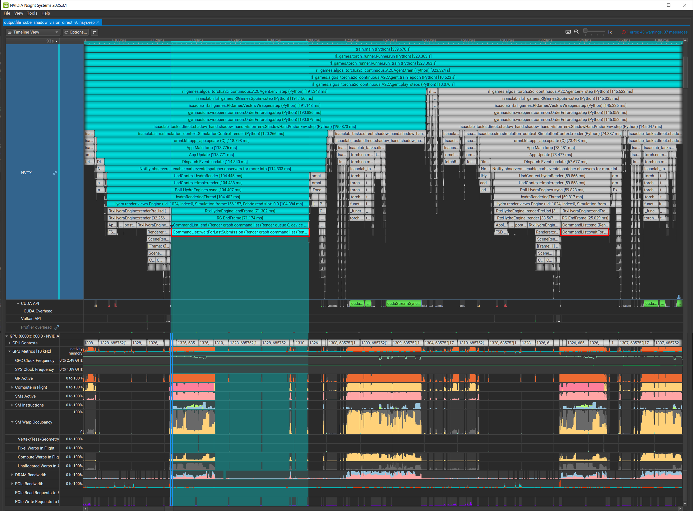

The top section shows NVTX ranges (teal bars) along the time axis. The bottom section shows CUDA API calls, GPU clock, SM Active, DRAM Active, memory bandwidth, and other GPU metrics simultaneously. This allows direct comparison of **how the GPU behaves during a specific NVTX interval** (computing, idle, memory bandwidth utilization) to identify bottlenecks.

**Method 2: nsys stats (CLI summary)**
```bash
nsys stats profile.nsys-rep
```

**Method 3: Convert to SQLite and query**
```bash
nsys export --type=sqlite -o profile.sqlite profile.nsys-rep
sudo apt-get install -y sqlite3  # Install if needed
```

Key SQL query examples:
```sql
-- NVTX Zone statistics (most commonly used query)
SELECT COALESCE(e.text, s.value) as zone_name,
       COUNT(*) as cnt,
       ROUND(AVG(e.end - e.start) / 1e6, 2) as avg_ms,
       ROUND(SUM(e.end - e.start) / 1e6, 2) as total_ms
FROM NVTX_EVENTS e
LEFT JOIN StringIds s ON e.textId = s.id
WHERE e.start > 25000000000    -- Skip first 25 seconds (remove startup noise)
  AND e.end IS NOT NULL
  AND (e.end - e.start) > 0
GROUP BY zone_name
ORDER BY total_ms DESC
LIMIT 30;
```

**Note:** The NVTX_EVENTS table does not have a `name` column. Use `text` (inline string) or `textId` (StringIds foreign key).

### 12.5 Windows nsys Differences

| Item | Linux | Windows |
|------|-------|---------|
| OS Runtime trace | `--trace=osrt` | Not supported |
| WDDM trace | N/A | `--trace=wddm` |
| DX12 trace | N/A | `--trace=dx12` |
| Target executable | Any including scripts | `.exe` only (not `.bat`) |
| nsys stats | Works normally | May encounter UnicodeDecodeError |
| Install path | `/usr/local/cuda-X.Y/bin/nsys` | `C:\Program Files\NVIDIA Corporation\Nsight Systems <ver>\...` |

On Windows, when profiling Isaac Sim, target `kit\python\kit.exe` directly instead of `python.bat`.

---

## 13. External Sampling Profilers

### 13.1 When External Profilers are Needed

Some situations are not covered by the CPU backend, Tracy, or Nsight:

- **Uninstrumented functions:** Native C++ code without `CARB_PROFILE_ZONE`
- **Complex mutex/lock issues:** Cross-thread synchronization problems
- **Deep callstack analysis:** When you need to know exactly which code line is consuming time
- **Third-party library internals:** Profiling without source code modification

In these cases, a **separate external sampling profiler** is needed.

### 13.2 Superluminal (Windows)

**Features:**
- Captures **all native functions** (no instrumentation required)
- Shows **code-level** overhead percentages — pinpoints exactly which line is the bottleneck
- Sampling-based, so overhead is very low
- Windows OS only

**Key capabilities:**
- Call tree / flame graph views
- Per-function, per-module CPU time analysis
- Per-thread activity analysis
- Lock contention visualization
- Source code-level hotspot display (per-line %)

**Use cases:**
- Analyzing native code bottlenecks in Kit/Isaac Sim
- Tracking performance issues inside specific DLLs/libraries
- Debugging performance degradation from mutex contention
- Deep profiling of uninstrumented code

**Superluminal screenshot example:**

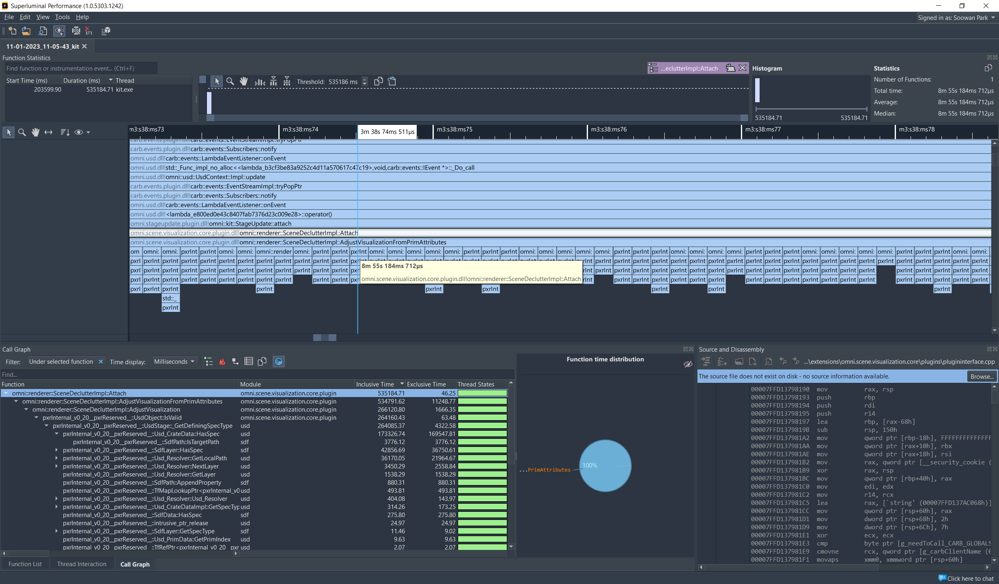

The screenshot above shows a Kit-based application profiled with Superluminal. The top timeline view shows per-thread activity visually. The bottom call tree shows per-function CPU time percentages. The Function Time Distribution chart on the right provides a quick overview of hotspots.

---

## 14. Common Performance Issues and Solutions

> This section covers performance issues frequently encountered during profiling and their solutions. The items below are patterns repeatedly observed in real profiling work.

### 14.1 PresentFrame is Abnormally Slow

Tracy may show the `PresentFrame` zone as abnormally long. There are two main causes:

**Cause 1: GPU Backpressure**

GPU work is backed up, and the CPU waits until the next swapchain buffer becomes available.

- **How to check:** Enable GPU zones in Tracy to inspect the GPU timeline
  ```bash
  --/profiler/gpu/tracyInject/enabled=true
  --/profiler/gpu=true
  --/rtx/addTileGpuAnnotations=true
  ```
- **Analysis:** Check whether rendering work on the GPU timeline is accumulating beyond the frame time. If GPU frametime exceeds CPU frametime, the GPU is the bottleneck and PresentFrame stalls waiting for the swapchain.

**The screenshot below shows a real example of PresentFrame waiting for GPU computation to finish:**

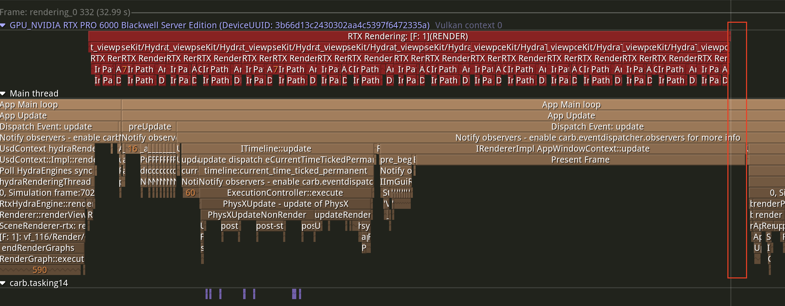

**Cause 2: VNC / Remote Desktop Environment**

Kit renders with the Vulkan API and presents the final output to the swapchain. With a physical monitor connected, present is fast. In remote environments (VNC, etc.), a virtual framebuffer (virtual display) is used, so the GPU driver's present timing and V-Sync behavior differ significantly. Without a real display signal, the driver handles present timing differently, causing Kit to wait for an extended period in the `PresentFrame` scope.

**The screenshot below shows a real example of PresentFrame slowing down in a VNC environment:**

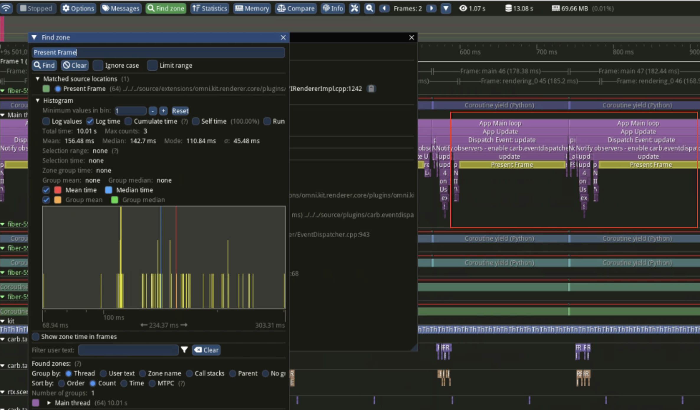

- **Solution:** For accurate performance measurement, test on a **system with a physical monitor directly connected**, or run in **headless mode**.

### 14.2 resolveSamplerFeedback is Abnormally Slow

Tracy may show the `resolveSamplerFeedback` zone taking unnecessarily long each frame. Particularly with multiple RenderProducts, thread waits occur for each one, significantly increasing frame time.

- **Cause:** Suspected bug in the Texture Streaming feature. Thread waits occur per frame proportional to the number of RenderProducts
- **Solution:** Disable Texture Streaming and test
  ```bash
  --/rtx-transient/resourcemanager/enableTextureStreaming=false
  ```
- **Effect:** Approximately **~6.72 ms saved per frame** (measured)

> **Note:** This setting completely disables texture streaming, so VRAM usage may increase with large scenes. Disable for performance measurement; for production environments, verify VRAM headroom before deciding.

### 14.3 Viewport/UI Rendering Overhead (Headless Mode)

When only simulation is needed without actual screen output (e.g., RL training, data generation, automated benchmarks), the default viewport and UI being active causes unnecessary rendering overhead. Disabling these reduces GPU frametime by approximately **3-4 ms** and eliminates unnecessary UI drawing overhead.

**Method 1: Isaac Sim — Using SimulationApp**
```python
from isaacsim import SimulationApp

simulation_app = SimulationApp({
    "headless": True,
    "disable_viewport_updates": True
})
# In headless mode, --no-window and --/app/window/hideUi=True are added automatically
```

**Method 2: Kit Args (direct specification)**
```bash
--no-window --/app/window/hideUi=True
```

Additionally, explicitly disable viewport updates in the Python script:
```python
from omni.kit.viewport.utility import get_active_viewport
get_active_viewport().updates_enabled = False
```

> **When to use:** For workflows that only need simulation results without real-time screen output (RL training, SDG data generation, automated benchmarks, etc.), headless mode is recommended. For performance measurement, this also removes viewport overhead to measure pure simulation/rendering performance.

### 14.4 Verifying Actual Render Count in Multi-Camera / GPU-Heavy Environments

In multi-camera or GPU-heavy simulations, **always check Tracy GPU zones to verify that only the intended number of cameras are actually rendering on the GPU**. Without verification, unnecessary background rendering may occur unnoticed.

**What to check in Tracy GPU zones:**

1. **Number of rendered cameras/textures:** Count `extrt/rtx/rtaTexturesMC_*` (camera textures) and `t_viewport_ViewportTexture_*` (viewport textures) entries in the GPU zone list. Verify the count matches the intended number of cameras. If more textures are rendering than expected, unnecessary viewports or cameras may be active.

2. **Rendering resolution:** Each GPU zone name includes the rendering resolution (e.g., `rtaTexturesMC_3_RP_1920x1080`, `ViewportTexture_1_1280x720`). Verify it matches the intended resolution. Unintended high-resolution rendering significantly increases GPU load.

**The screenshot below shows a real Tracy GPU zone example:**

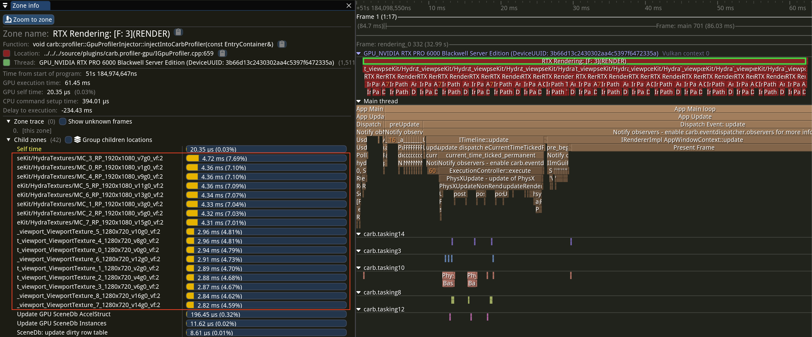

In the example above, the GPU zone list on the left shows:
- `extrt/rtx/rtaTexturesMC_3_RP_1920x1080_*` — Multiple camera textures rendering at 1920x1080
- `t_viewport_ViewportTexture_*_1280x720_*` — Viewport textures also rendering simultaneously at 1280x720

When **viewport textures and camera textures render simultaneously**, GPU load doubles. In headless mode where only simulation is needed, verify that unnecessary viewport textures are not still rendering in the background.

> **Checklist:**
> - [ ] Does the number of textures rendering in GPU zones match the intended camera count?
> - [ ] Does each texture's resolution match the intended resolution?
> - [ ] Are unnecessary viewport textures rendering in the background?

### 14.5 PhysX Overhead

To analyze PhysX performance correctly, pay attention to the **profiler mask setting** when capturing with Tracy. The number of internal zones visible under `PhysX simulate` changes dramatically depending on the profiler mask value.

The screenshots below show the same simulation captured with different profiler mask settings.

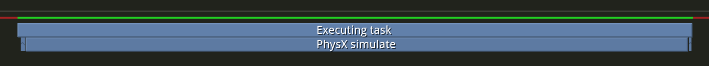

*Screenshot 1 — Captured with `profilerMask=1`. Almost no internal spans are visible under the `PhysX simulate` zone; only a single large block is shown. It is impossible to identify which sub-task is consuming time.*

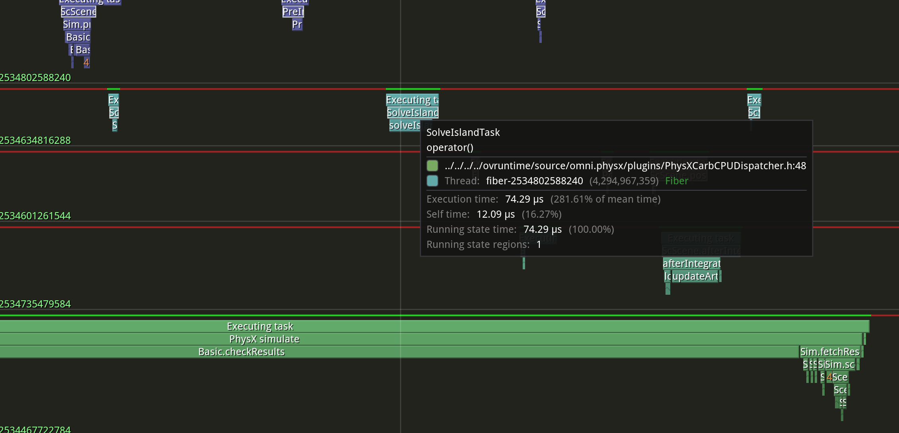

*Screenshot 2 — Captured with the profiler mask cleared so that all zones are recorded. Many more internal spans are exposed under `PhysX simulate`, including `SolveIslandTask`, `Sim.fetchResults`, `Basic.checkResults`, `AfterIntegrate`, and `updateArticulations`. Only in this state can the exact bottleneck inside PhysX be diagnosed.*

When analyzing internal PhysX bottlenecks, clear the profiler mask to expose full detail.

**Tuning flag:**

| Flag | Description |
|---|---|
| `--/physics/suppressReadback=true` | Suppress GPU→CPU readback (no effect in CPU mode) |

`suppressReadback` may improve performance depending on the simulation scenario.

**Additional tuning options:**

- **`PhysxSceneAPI.updateType = asynchronous`** — Runs PhysX `simulate` on a separate thread from the render thread. This cannot be set via a carb CLI flag; it is a USD schema attribute and must be applied directly to the stage's `PhysicsScene` prim. In Python:

  ```python
  from pxr import UsdPhysics
  from pxr import PhysxSchema

  stage = omni.usd.get_context().get_stage()
  for prim in stage.Traverse():
      if prim.IsA(UsdPhysics.Scene):
          api = PhysxSchema.PhysxSceneAPI.Apply(prim)
          api.CreateUpdateTypeAttr().Set(PhysxSchema.Tokens.asynchronous)
  ```

  Applicable when it is acceptable for the rendered frame to consume the previous frame's physics result (e.g., RL training, SDG, and other workloads that do not require frame-accurate reactive control). A slight performance gain may be possible depending on the scenario.

- **`--/physics/updateToUsd=false`** — Disables write-back of physics simulation results to the USD stage. If the viewport renders objects through USD transforms, visual updates will stop; use only in workloads that do not read physics state from USD (e.g., custom renderers, fabric-based pipelines). A slight performance gain may be possible when these conditions are met.

- **`--/physics/disableContactProcessing=true`** — Disables PhysX contact event callback processing. Useful in pure dynamics scenarios where no Python/extension subscriber consumes contact events (e.g., visualization-only runs, or cases where contact events are irrelevant to gameplay). A slight performance gain may be possible.

- **`PhysxSceneAPI.solverType = TGS`** — The solver implementation can be changed from the default (PGS) to TGS. It may help depending on the scenario.

### 14.6 Extension Change Detection (fsWatcher) Overhead

Kit monitors extension file changes in real time every frame by default (hot-reload / hot-plugin). Extension change detection logic is called at the end of every frame, taking approximately **0.1ms**. Further analysis is needed on whether this can be skipped in simulation scenarios.

This is a convenience feature for development, but introduces unnecessary overhead in runtime benchmarks and production environments.

Setting `--/app/extensions/fsWatcherEnabled=false` disables runtime extension change detection for a slight performance gain:

```
--/app/extensions/fsWatcherEnabled=false
```

> **Note:** With this setting disabled, modifying extension files at runtime will not trigger automatic reload. Keep it enabled during development; disable only for benchmarks/production.
>
> **Reference:** [Extensions Advanced — fsWatcherEnabled](https://docs.omniverse.nvidia.com/kit/docs/kit-manual/107.3.1/guide/extensions_advanced.html#app-extensions-fswatcherenabled-default-true)

### 14.7 Viewport Gizmo Rendering Overhead

Rendering all viewport gizmos (manipulators, grid, selection outlines, etc.) can significantly degrade performance. In scenes with many objects, the rendering cost of gizmos themselves is substantial.

In benchmark or simulation-only environments, disabling gizmos is a simple optimization. Deactivating the viewport HUD, selection highlight, transform manipulator, and other visual aids reduces unnecessary draw calls.

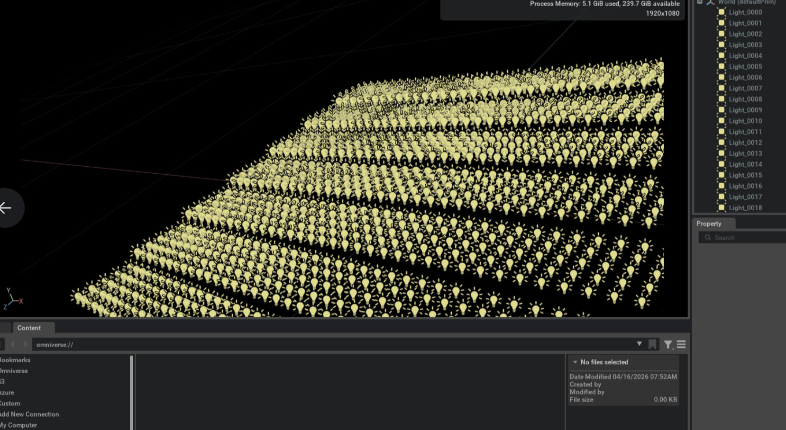

*19,600 SphereLights (140x140 grid) with gizmos rendered in the viewport. Each light draws a gizmo visualizing its position/direction/range, causing frame rate to drop sharply compared to the gizmo-free state. In scenes with thousands of objects or more, gizmo rendering itself can become a CPU bottleneck.*

The Tracy profiling screenshot below shows the `GizmoController update` overhead in the Main thread. The `GizmoController update`, `GizmoController update wait for Usd read`, `GizmoController update Usd processing`, and `GizmoController clearInvalidGizmos` zones consume a visible portion of each frame when many gizmos are active.

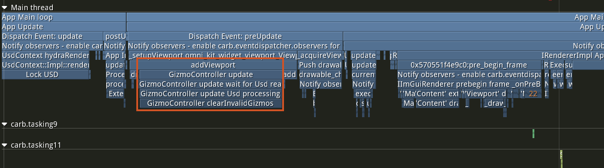

Disable gizmos during benchmarks with these settings:

```
--/persistent/app/viewport/displayOptions=0
--/persistent/app/viewport/gizmo/enabled=false
```

### 14.8 DLSS-G (Frame Generation) FPS Reporting

When DLSS-G (Frame Generation) is active, **the FPS shown in the Viewport HUD is not the actual rendering FPS.**

DLSS-G inserts AI-generated sub-frames between actually rendered frames. The Viewport HUD FPS is simply multiplied by the sub-frame count:

| GPU Generation | Sub-frame Multiplier | Example |
|---------------|---------------------|---------|
| Ada (RTX 40 series) | x2 | Actual 60 FPS → HUD shows 120 FPS |
| Blackwell (RTX 50 series) | x3 - x4 | Actual 60 FPS → HUD shows 180-240 FPS |

**Important:** Tracy measures frametime without DLSS-G sub-frames — it reports the **actual rendering frametime**. Therefore:

- Even if Viewport HUD shows 240 FPS, if Tracy frametime is ~16ms → actual rendering is ~60 FPS.
- For performance comparison, always measure with **Tracy frametime** or with **DLSS-G disabled** for accurate numbers.

> **If you rely on Viewport HUD FPS with DLSS-G active, you may overestimate performance by 2-4x.**

### 14.9 HydraEngine waitIdle — GPU Synchronization Wait

Tracy may show the `/app/hydraEngine/waitIdle` zone taking abnormally long. When observing this, **it is important to determine whether this is intentional synchronization or not.**

**How it works:**

When `/app/hydraEngine/waitIdle=true` (default), the main thread waits every frame until all GPU computation for that frame completes. This guarantees full CPU-GPU synchronization, but in GPU-heavy scenes the main thread blocks in an idle state waiting for the GPU.

**Optimization:**

If you do not need to wait for all GPU computation to finish within the same frame:

```
--/app/hydraEngine/waitIdle=false
```

This allows the main thread to proceed to the next frame's logic without waiting for GPU completion, improving CPU-GPU pipelining efficiency.

> **This setting is case-by-case.** Workloads that need to read GPU results in the same frame (e.g., physics simulation readback, synchronous sensor data collection) may require `waitIdle=true`. For rendering-only workloads, `false` is safe. Check this zone's duration in Tracy and determine whether synchronization is truly needed for the specific workload.

### 14.10 Multi-GPU is Not Always Faster

A common misconception is that multi-GPU always improves performance. **Multi-GPU is only effective when the GPU is a clear bottleneck. Otherwise, performance may degrade.**

#### Why Multi-GPU Can Be Slower

Multi-GPU rendering requires additional CPU work:

1. **Job distribution overhead** — Logic to split existing rendering work across multiple GPUs.
2. **Per-GPU computation setup** — Command buffer creation, resource synchronization, and other preparation per GPU.
3. **Data gathering** — Results from each GPU must be combined into one, incurring inter-GPU data transfer overhead.

This CPU overhead increases with the number of GPUs. Multi-GPU provides a net benefit only when GPU computation time is long enough to more than offset this overhead.

#### When Multi-GPU is Effective

| Scenario | Recommended GPU Count | Reason |
|----------|----------------------|--------|
| High resolution (3840x2160) x many cameras (4-8) | Multi-GPU effective | GPU workload is large enough to offset distribution overhead |
| Low resolution (1920x1080) x few cameras (1-2) | Single GPU is faster | GPU workload is light; distribution/gathering overhead dominates |
| CPU-bottlenecked workload | Adding GPUs is pointless | Bottleneck is not the GPU, so adding GPUs yields no improvement |

#### Benchmark Results

The graph below shows FPS measurements from Isaac Sim 6.0.0 across GPU count x camera count combinations:

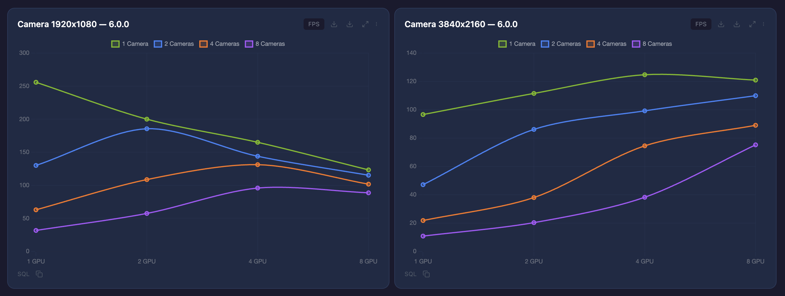

**Left (1920x1080):** At low resolution, 1 GPU is fastest with 1 camera, and FPS decreases as GPUs are added. The benefit of multi-GPU only appears with more cameras (4-8).

**Right (3840x2160):** At high resolution, multi-GPU effectiveness increases dramatically with more cameras. The 8 Camera x 8 GPU combination shows a large FPS gain, because the GPU workload is large enough to far outweigh distribution overhead.

> **Key principle:** Before suggesting or testing multi-GPU, always verify with Tracy or Nsight Systems that the current workload is **GPU-bottlenecked**. Adding GPUs to a non-GPU-bottlenecked workload only increases CPU overhead and degrades performance.

### 14.11 CPU Governor — Performance Degradation from powersave Mode

One frequently discovered issue in performance support engagements is the **Linux CPU governor set to `powersave` mode**. In `powersave` mode, the CPU clock is locked to a low frequency, preventing maximum performance in simulation and rendering.

**Real-world case:** Changing the CPU governor from `powersave` to `performance` alone reduced **frame time by approximately 4ms**.

**How to check:**

```bash
# Check current CPU governor
cat /sys/devices/system/cpu/cpu*/cpufreq/scaling_governor | sort | uniq -c
```

If the output shows `powersave`, performance is being throttled.

**How to change:**

```bash
# Change to performance mode (requires root)
echo performance | sudo tee /sys/devices/system/cpu/cpu*/cpufreq/scaling_governor

# Verify the change
cat /sys/devices/system/cpu/cpu*/cpufreq/scaling_governor | sort | uniq -c
```

> **Always verify the CPU governor is set to `performance` before running benchmarks or profiling.** Results measured in `powersave` or `ondemand` mode are inconsistent due to CPU clock scaling and do not represent actual workload performance.

### 14.12 RTX Tuning When GPU-Bound — IsaacLab Presets & DLSS

When the app is GPU-bound, RTX settings have a significant impact on performance.

> **Recommended tuning order:** Rather than tuning every RTX parameter individually, **start from an IsaacLab preset and then re-enable individual parameters based on the scene's visual quality requirements.** This is the most efficient approach.

#### IsaacLab Three Presets — Performance Comparison

Measured on ChessRTX path-traced scene, RTX PRO 6000 Blackwell, Kit 110.1.1, WARM-phase IDLE FPS.

| Preset | FPS | Δ vs baseline | Use case |
|---|---|---|---|
| (no preset, default) | 51.85 | — | Default |
| `isaaclab_quality` | 70.25 | **+35.5%** | Visual quality priority |
| `isaaclab_balanced` | 87.81 | **+69.4%** | Quality/performance mid-point |
| `isaaclab_performance` | 111.90 | **+115.8%** | Maximum performance |

Full enumeration of every RTX/performance-related parameter **explicitly set** in each preset's source `.kit` file (`IsaacLab/apps/rendering_modes/{performance,balanced,quality}.kit`). Rows with identical values are shown as well, so you can see where presets align vs diverge. `(commented)` indicates the line is present in the `.kit` but commented out (i.e., engine default applies).

| # | Setting | quality | balanced | performance |
|---|---|---|---|---|
| 1 | `/rtx/translucency/enabled` | true | false | false |
| 2 | `/rtx/reflections/enabled` | true | false | false |
| 3 | `/rtx/reflections/denoiser/enabled` | true | true | **false** |
| 4 | `/rtx/directLighting/sampledLighting/denoisingTechnique` | *(commented)* | *(commented)* | **0** |
| 5 | `/rtx/directLighting/sampledLighting/enabled` | true | true | **false** |
| 6 | `/rtx/sceneDb/ambientLightIntensity` | 1.0 | 1.0 | 1.0 |
| 7 | `/rtx/shadows/enabled` | true | true | true |
| 8 | `/rtx/indirectDiffuse/enabled` | true | false | false |
| 9 | `/rtx/indirectDiffuse/denoiser/enabled` | true | true | **false** |
| 10 | `/rtx/domeLight/upperLowerStrategy` | *(commented, comment notes `=4`)* | *(commented)* | **3** |
| 11 | `/rtx/ambientOcclusion/enabled` | true | false | false |
| 12 | `/rtx/ambientOcclusion/denoiserMode` | 0 | 1 | 1 |
| 13 | `/rtx/raytracing/subpixel/mode` | 1 | 0 | 0 |
| 14 | `/rtx/raytracing/cached/enabled` | true | true | **false** |
| 15 | `/rtx-transient/dlssg/enabled` | false | false | false |
| 16 | `/rtx-transient/dldenoiser/enabled` | true | true | **false** |
| 17 | `/rtx/post/dlss/execMode` | **2** | **1** | **0** |
| 18 | `/rtx/pathtracing/maxSamplesPerLaunch` | 1000000 | 1000000 | 1000000 |
| 19 | `/rtx/viewTile/limit` | 1000000 | 1000000 | 1000000 |

> **Measurement scope note:** The preset FPS numbers above were obtained by applying carb CLI flags only for items 1–17 (the rows that differ between presets). Items 18·19 (`maxSamplesPerLaunch`, `viewTile/limit`, both 1000000 in all three presets) are common safety caps and were not individually toggled in the ablation — the engine default value was used during measurement. These two caps exist to avoid warnings/silent-trimming in replicator / tiled-camera setups and have no measurable performance impact on the ChessRTX path-traced scene used here.

**Findings from leave-one-out ablation (on the ChessRTX path-traced scene):**
- Of `isaaclab_performance`'s **+115.8%, approximately 91% comes from a single line (`--/rtx/post/dlss/execMode=0`)**.
- `/rtx-transient/dldenoiser=false` is the second most meaningful single effect (−6% when re-enabled).
- The remaining individual effect toggles (translucency, reflections, indirectDiffuse, AO, etc.) are ±1% noise — the GPU is saturated on the core path-trace loop, so CPU-side toggles have little impact.

#### DLSS `execMode` Alone (DLSS-G Fixed OFF)

Keeping all other settings at default, DLSS-G explicitly OFF, only `--/rtx/post/dlss/execMode` varied:

| execMode | Mode | FPS | Δ vs baseline |
|---|---|---|---|
| *(default)* | DLSS off | 51.85 | — |
| `0` | **Performance** | **106.24** | **+104.9%** |
| `1` | Balanced | 87.08 | +68.0% |
| `2` | Quality | 71.42 | +37.7% |

> **This single parameter is the first lever to consider when GPU-bound.** `execMode=3` (Auto) is broken in headless, so always specify an explicit 0/1/2.

#### DLSS-G (Frame Generation) — Viewport vs Simulation

With DLSS execMode=0 fixed, toggling only `--/rtx-transient/dlssg/enabled`:

| DLSS-G | Benchmark FPS (frame-time based) | Δ vs baseline |
|---|---|---|
| OFF | 105.30 | +103.1% |
| ON  |  89.16 | +71.9% |

**Wait — why is benchmark FPS lower with DLSS-G on? This discrepancy is intentional.** As explained in §14.8, the two FPS measurement methods report different values:

| Measurement | With DLSS-G ON |
|---|---|
| **Viewport HUD FPS** (frames displayed per unit time, including AI-generated sub-frames) | **Higher** |
| **Benchmark frame-time-based FPS** (CPU+GPU frame generation time basis) | **Lower** |

DLSS-G inserts AI sub-frames between real frames, raising the frame rate seen on screen, but increasing the GPU time needed to produce a real frame. Because the benchmark measures frame-time, the reported FPS number appears lower. The frame rate the user sees (viewport HUD) is actually higher with DLSS-G ON.

**DLSS-G usage guidance:**

| Workload | DLSS-G | Reason |
|---|---|---|
| **Viewport interactive** (editing, visualization, demos) | **ON** | Increases perceived frame rate. This is DLSS-G's intended use. |
| **Simulation / SIL / HIL** (RL training, SDG, automated benchmarks) | **OFF** | Real rendered frame count is what matters. AI-generated sub-frames are not used for simulation results and only add GPU work. |

For this reason, **Isaac Sim's default is DLSS-G always OFF**, and all three IsaacLab presets (quality/balanced/performance) set DLSS-G to OFF explicitly.

> **One-line summary:** DLSS-G is for viewport — do not use it for simulation.

#### Tuning Checklist (When GPU-Bound)

1. First confirm with Tracy/Nsight that the bottleneck is **actually the GPU** (RTX tuning has no effect on CPU-bound workloads).
2. For simulation/SIL/HIL workloads, verify `--/rtx-transient/dlssg/enabled=false` (default is off, but double-check).
3. Biggest single lever: `--/rtx/post/dlss/execMode=0` (in headless, always specify 0/1/2 — not 3).
4. For more performance, apply the IsaacLab `isaaclab_performance` preset.
5. If a specific visual effect is required, selectively re-enable only that parameter on top of the preset.
6. The numbers above are from the ChessRTX path-traced scene; individual effect toggles may have much larger impact depending on the scene.

---

## Appendix A: Environment Variable Reference

| Variable | Value | Purpose |
|----------|-------|---------|
| `CARB_PROFILING_PYTHON` | `1` | Python function-level profiling (high overhead) |
| `TRACY_NO_SYS_TRACE` | `1` | Disable Tracy system tracing |
| `TRACY_NO_CALLSTACK` | `1` | Disable Tracy callstack collection |
| `TRACY_PORT` | `8086`/`8087` | Tracy server port. If another application is already using the default port, set this variable to use an alternative port (e.g., `export TRACY_PORT=8088`). Kit also automatically increments the port on conflict. |

## Appendix C: Tracy Memory Profiling Settings

### C.1 Environment variables (required on Linux)

The `omni.cpumemorytracking` extension works by LD_PRELOAD-ing `liballocwrapper.so` to intercept malloc/free. If you enable the extension without LD_PRELOAD, the Kit log prints a `Failed to load library: 'liballocwrapper.so'` warning and **no memory events are captured**.

```bash
# Path to the allocwrapper that Packman has downloaded (version path varies)
export LD_PRELOAD=~/.cache/packman/chk/allocmemwrapper/<version>/liballocwrapper.so
export TRACY_USE_LIB_UNWIND_FOR_BT=1   # libunwind-based backtrace
export TRACY_NO_SYS_TRACE=1            # disable system tracing (lower overhead)
```

### C.2 Kit flags for CPU + GPU memory capture

```bash
# Base Tracy backend + memory capture depth
--/app/profilerBackend=tracy
--/app/profileFromStart=true
--/profiler/enabled=true
--/plugins/carb.profiler-tracy.plugin/skipEventsOnShutdown=true
--/plugins/carb.profiler-tracy.plugin/memoryTraceStackCaptureDepth=16

# Disable tasking/events channels — too many spans
--/profiler/channels/carb.tasking/enabled=false
--/profiler/channels/carb.events/enabled=false

# CPU memory tracking
--enable omni.cpumemorytracking
--/profiler/channels/cpu.memory/enabled=true
--/plugins/carb.cpumemorytracking.plugin/minCpuAllocSizeInBytesToTrack=1024

# GPU memory tracking (carb.memorytracking plugin)
--/plugins/carb.memorytracking.plugin/enabled=true
--/profiler/channels/graphics.memory/enabled=true
```

### C.3 Unset LD_PRELOAD before launching the capture binary

Only Kit (the main process) should use the interposer. The Tracy `capture` binary must not be launched with LD_PRELOAD, so unset it in the script right before starting capture.

```bash
# After launching Kit with LD_PRELOAD=... in the background
unset LD_PRELOAD   # keep the interposer out of the capture process
./tracy/capture -o memtrace.tracy -f
```

### C.4 Verify the capture — binary strip test

Do not rely on a Kit log line to claim "memory capture succeeded". Verify the output file with a strip test:

```bash
# Strip only memory events into a new file and compare sizes
./tracy/update -s M memtrace.tracy memtrace_no_mem.tracy

# Good capture:   memtrace.tracy 67 MB → memtrace_no_mem.tracy 44 MB (~23 MB of mem data)
# Broken capture: memtrace.tracy 18 MB → memtrace_no_mem.tracy 18 MB (no delta = zero memory data)
```

The Kit log must contain both of these lines:
```
[carb.cpumemorytracking] Loaded shared library: 'liballocwrapper.so'
[carb.cpumemorytracking] set memory alloc/free callbacks successfully!
```
If you see `Failed to load library: 'liballocwrapper.so'` instead, the LD_PRELOAD path is wrong — stop and fix the path before re-running.

### C.5 Example of a good capture (Tracy Memory tab)

With LD_PRELOAD set correctly, Tracy's Memory tab fills in with real allocations:

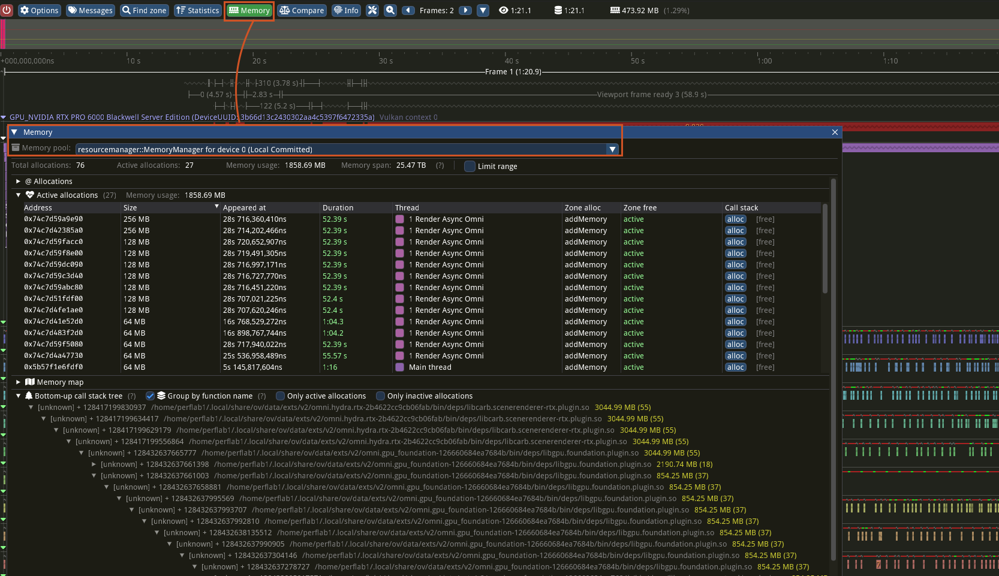

- Live counters like Active allocations 133,856 / Memory usage 38.47 MB appear, and the callstack tree at the bottom groups allocations by function.
- If the Memory tab is empty, either LD_PRELOAD failed or the `cpu.memory` channel is off — recheck C.1 / C.2 / C.4.

### C.6 Debug symbols are required for accurate code locations

The `??` and `[unknown] ??:???` entries in the allocation list `Source` column and the bottom-up callstack tree mean **debug symbols are missing**. A stripped release binary only has addresses — there is nothing to resolve into function names, source files, and line numbers.

To see real code locations (function name, `file:line`), one of the following is required:

- A build with debug symbols — e.g., `RelWithDebInfo`, or a build that preserves `.debug` / `.pdb` files
- A separate debuginfo package for the same build, served via `debuginfod` or placed in a local symbol directory
- Tracy GUI's symbol path setting (**Tools → Resolve symbol path**, etc.) pointing at the symbol files

Without symbols you can still analyze allocation size / count / lifetime numerically, but "which function allocated this" type of code-level analysis is not possible. For profiling builds, prefer a `RelWithDebInfo` or equivalent configuration that keeps symbols.

### C.7 Common mistakes (items missing from earlier revisions of this guide)

The first revision of this guide listed only the Kit flags and skipped the items below, so people following the guide produced `.tracy` files with zero memory data. Added here:

- :warning: `LD_PRELOAD=liballocwrapper.so` — without it, the extension reports "startup" but malloc/free hooks never install.
- :warning: `TRACY_USE_LIB_UNWIND_FOR_BT=1`, `TRACY_NO_SYS_TRACE=1` — affect backtrace quality / overhead.
- :warning: GPU memory tracking: `--/plugins/carb.memorytracking.plugin/enabled=true` + `--/profiler/channels/graphics.memory/enabled=true`.
- :warning: `unset LD_PRELOAD` before launching the capture binary — skipping causes the interposer to bleed into the capture process.
- :warning: Verify the **binary contents** via strip test / csvexport. The Kit log text alone is not enough.

## Appendix D: Python Function Profiling with NVTX (Non-Kit Environments)

Isaac Lab 3.0 and later has preset combinations that do not use Kit. In those cases, the Carbonite-based Python profiling environment variable (`CARB_PROFILING_PYTHON`) does not work, so profiling all Python functions requires a separate hook using `sys.setprofile()` and NVTX.

This method is similar to Carbonite's Python capture but operates at the Python level, so it has higher overhead than the Carbonite approach.

### Setup

```bash
# Run from the Isaac Lab directory
# 1. Install nvtx
uv pip install nvtx

# 2. Create sitecustomize.py (auto-loaded at interpreter startup)
SITE_PACKAGES=$(uv run python -c "import site; print(site.getsitepackages()[0])")
cat > "$SITE_PACKAGES/sitecustomize.py" << 'EOF'
import os
if os.environ.get('NVTX_PROFILE_PYTHON') == '1':
    import sys
    try:
        import threading, nvtx
        _inc = tuple(filter(None, os.environ.get('NVTX_PROFILE_INCLUDE', '').split(',')))
        _exc = tuple(filter(None, os.environ.get('NVTX_PROFILE_EXCLUDE', 'importlib').split(',')))
        _cache = {}
        _tls = threading.local()

        def _cb(f, ev, a):
            if ev == 'call':
                m = f.f_globals.get('__name__', '')
                r = _cache.get(m)
                if r is None:
                    if any(m.startswith(e) for e in _exc):
                        r = False
                    else:
                        r = not _inc or any(m.startswith(i) for i in _inc)
                    _cache[m] = r
                if r:
                    if not hasattr(_tls, 'd'): _tls.d = 0
                    nvtx.push_range(f"{m}.{f.f_code.co_name}")
                    _tls.d += 1
            elif ev == 'return' and hasattr(_tls, 'd') and _tls.d > 0:
                nvtx.pop_range()
                _tls.d -= 1
            return _cb

        sys.setprofile(_cb)
        threading.setprofile(_cb)
        print(f"[NVTX] Python profiling enabled (include={_inc or 'all'}, exclude={_exc})", file=sys.stderr)
    except Exception as e:
        print(f"[NVTX] Failed: {e}", file=sys.stderr)
EOF
echo "Created: $SITE_PACKAGES/sitecustomize.py"
```

### Environment Variables

| Variable | Description | Default | Example |
|----------|-------------|---------|---------|
| `NVTX_PROFILE_PYTHON` | Set to `1` to enable profiling | (unset) | `1` |
| `NVTX_PROFILE_INCLUDE` | Module prefixes to trace (comma-separated). Empty means all. | (all) | `isaaclab,skrl,torch` |
| `NVTX_PROFILE_EXCLUDE` | Module prefixes to exclude (comma-separated). | `importlib` | `importlib,threading,nvtx` |

### Usage Examples

Running with Nsight Systems:

```bash
# Capture all Python modules
NVTX_PROFILE_PYTHON=1 \
nsys profile -t nvtx,cuda,osrt \
uv run python scripts/reinforcement_learning/skrl/train.py \
  --task=Isaac-Velocity-Flat-Anymal-C-v0 --num_envs=1024 --max_iterations=10

# Capture specific modules only (reduces overhead)
NVTX_PROFILE_PYTHON=1 NVTX_PROFILE_INCLUDE=isaaclab,skrl \
nsys profile -t nvtx,cuda,osrt \
uv run python scripts/reinforcement_learning/skrl/train.py \
  --task=Isaac-Velocity-Flat-Anymal-C-v0 --num_envs=1024 --max_iterations=10
```

### Performance Considerations

- Tracing all Python functions incurs **a callback on every function call/return**, causing significant overhead. Use `NVTX_PROFILE_INCLUDE` to limit tracing to modules of interest.
- To disable, run without the `NVTX_PROFILE_PYTHON` environment variable, or delete `sitecustomize.py`.

> **Note:** If you already know which Python modules and functions to trace, you can also use the Nsight Systems built-in feature `nsys --python-functions-trace`. See the [Nsight Systems User Guide](https://docs.nvidia.com/nsight-systems/UserGuide/index.html) for details.

